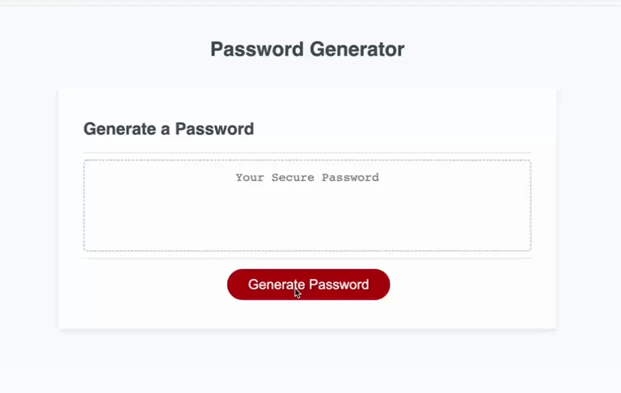

# Password Generator

## Description

This is a password generator.

It allows users to choose password length between 8 to 128, whether or not to include numbers, lowercase letters, uppercase letters and special characters. 

## Usage

* When a user clicks the 'Generate Password' button, a series of prompts will show up to let the user input a number for password length. 
* Then select whether or not to include numbers, lowercase letters, uppercase letters and special characters.
* At least **one** type should be selected to generate password.

* The animation below web application's appearance and functionality:

## Sources Referenced
Google || Youtube 

